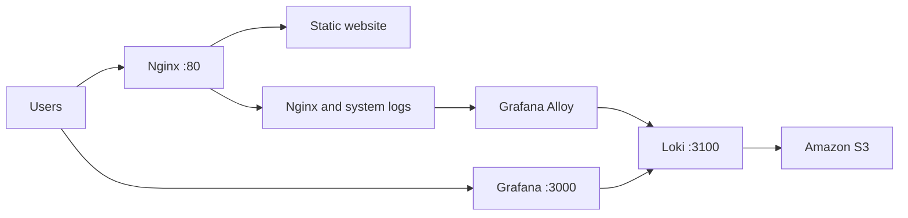

# Standalone EC2 Grafana, Loki, Alloy and Nginx

Terraform project for deploying an observability stack on a single **Amazon Linux 2023 x86_64 EC2 instance**:

- **Grafana** for dashboards and log exploration
- **Grafana Loki** for log storage
- **Grafana Alloy** for collecting and forwarding logs
- **Amazon S3** as Loki object storage
- **Nginx** for serving a static website
- **systemd** services for automatic startup and restart

This layout is intentionally simple and suitable for a lab, proof of concept, or small internal environment. For production workloads, consider a highly available architecture, private subnets, TLS, centralized access control, and managed observability services.

## Architecture



Grafana and Loki run on the same EC2 instance. Grafana connects to Loki over localhost, so Loki does not need to be exposed publicly.

## Project structure

| File | Purpose |
|---|---|
| `ec2.tf` | Creates the EC2 instance and related compute configuration |
| `iamrole.tf` | Creates the IAM role, policy, and instance profile |
| `s3_bucket.tf` | Creates the S3 bucket used by Loki |
| `providers.tf` | Configures the AWS provider |
| `variables.tf` | Defines Terraform input variables |
| `terraform.tfvars` | Provides environment-specific values |
| `outputs.tf` | Displays IP addresses and service URLs |
| `script.sh` | EC2 user-data installation and configuration script |

## Prerequisites

Before deploying, make sure you have:

| Requirement | Description |
|---|---|
| Terraform | Installed and available in your `PATH` |
| AWS CLI | Installed and authenticated with the target AWS account |
| AWS permissions | Permission to create EC2, IAM, S3, and security group resources |
| EC2 key pair | Required if SSH access is enabled |
| VPC and subnet | A subnet with appropriate routing and internet access |
| AMI | Amazon Linux 2023 x86_64 |

Verify your AWS identity before applying:

```bash
aws sts get-caller-identity
```

## Network access

The EC2 security group allows the following ports:

| Port | Protocol | Purpose |
|---:|---|---|
| 22 | TCP | SSH administration |
| 80 | TCP | Nginx website |
| 3000 | TCP | Grafana web interface |

Loki's HTTP port `3100` and gRPC port `9096` should remain closed to the public internet. They are used for local or private communication only.

## Configuration

Review `variables.tf` and update `terraform.tfvars` for your environment before deploying. Typical values include the AWS region, instance type, AMI ID, key pair name, VPC ID, subnet ID, and allowed SSH/Grafana CIDR ranges.

Do not commit credentials, private keys, or sensitive environment-specific values. Add sensitive files to `.gitignore` where appropriate. A safer pattern is to supply sensitive variables through environment variables or a separate tfvars file that is excluded from Git.

Example `.gitignore` entries:

```gitignore
*.tfstate
*.tfstate.*
.terraform/
*.tfvars
*.tfvars.json
crash.log
```

Keep a non-sensitive `terraform.tfvars.example` file in the repository if you want to document the required inputs.

## Deploy

Run these commands from the Terraform project directory:

```bash
terraform fmt -recursive
terraform init
terraform validate
terraform plan
terraform apply
```

Review the plan and confirm the apply when Terraform prompts you.

## View Terraform outputs

```bash
terraform output
```

Expected outputs include:

- `instance_public_ip`
- `instance_private_ip`
- `Static_Web`
- `StaticWeb_buildinfo`

## Access the services

Replace `<EC2_PUBLIC_IP>` with the public IP returned by Terraform.

| Service | URL |
|---|---|
| Nginx website | `http://<EC2_PUBLIC_IP>/` |
| Build information | `http://<EC2_PUBLIC_IP>/build_info` |
| Grafana | `http://<EC2_PUBLIC_IP>:3000` |

The Grafana username and generated password are stored on the instance at:

```bash
sudo cat /root/grafana-credentials.txt
```

Protect this file and change the generated password after the first login.

## Grafana and Loki

The Loki datasource is provisioned automatically with the following URL:

```text
http://127.0.0.1:3100
```

In Grafana, open **Explore**, select the Loki datasource, and try these queries:

```logql
{job="nginx"}
{job="nginx", log_type="access"}
{job="nginx", log_type="error"}
{job="system"}
{job="systemd-journal"}
{job="user-data"}
```

## Logs collected by Alloy

Alloy forwards the following sources to Loki:

- Nginx access log
- Nginx error log
- `/var/log/*.log`
- `/var/log/user-data.log`
- systemd journal

## Verify the deployment

### Check service status

```bash
sudo systemctl status nginx --no-pager
sudo systemctl status loki --no-pager
sudo systemctl status alloy --no-pager
sudo systemctl status grafana-server --no-pager
```

### Check recent service logs

```bash
sudo journalctl -u loki -n 50 --no-pager
sudo journalctl -u alloy -n 50 --no-pager
sudo journalctl -u grafana-server -n 50 --no-pager
sudo tail -n 50 /var/log/user-data.log
```

### Test Loki locally

```bash
curl http://127.0.0.1:3100/ready
```

Expected response:

```text
ready
```

### Test Nginx locally

```bash
curl http://127.0.0.1/
curl http://127.0.0.1/build_info
```

## Re-run user data

EC2 user data normally runs only during the instance's first boot. To recreate the instance using the latest `script.sh`, run:

```bash
terraform apply -replace='aws_instance.loki-vm'
```

Review the plan carefully because replacing the instance may change its public IP and remove data stored locally on the instance.

## Security recommendations

- Restrict SSH port `22` to your own public IP address rather than `0.0.0.0/0`.
- Restrict Grafana port `3000` to trusted users or access it through a VPN or reverse proxy.
- Do not expose Loki ports `3100` or `9096` publicly.
- Use HTTPS and a domain name before exposing Grafana outside a trusted network.
- Protect `/root/grafana-credentials.txt` and rotate the password after deployment.
- Avoid writing passwords or other secrets to `/var/log/user-data.log`.
- Use an Elastic IP if the public IP must remain stable.
- Follow least privilege when defining the EC2 IAM policy for S3 access.
- Enable appropriate S3 encryption, versioning, lifecycle rules, and access controls for production data.

## Destroy the infrastructure

To remove Terraform-managed resources:

```bash
terraform destroy
```

Review the destroy plan carefully before confirming. Depending on the S3 configuration and retained objects, Loki data may require separate cleanup.

## License

Add your project license here, for example `MIT`, if this repository is intended for public reuse.
